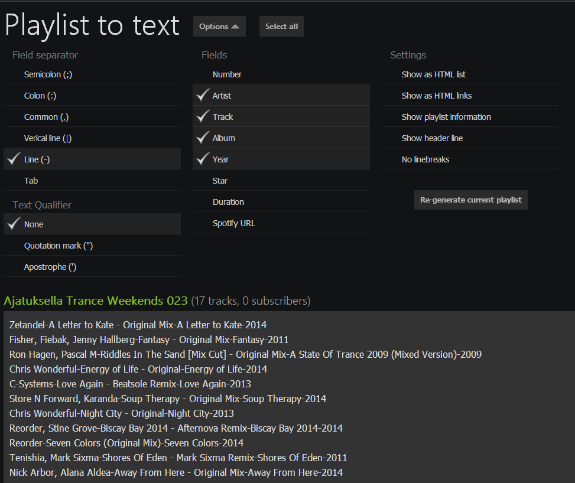

Spotify Playlist to Text
========================

Exports Spotify playlists to text (Spotify App)

How to install
========================

1. Your Spotify account must be Spotify Developer Account 
   Read more: https://developer.spotify.com/technologies/apps/
2. Download/Clone ZIP
3. Extract <b>playlisttotext</b> folder to your Spotify folder
4. Restart Spotify, type <b>spotify:app:playlisttotext</b> to search bar and press enter

<b>Spotify folder on Windows:</b> 
C:\Users\YOURNAME\My Documents\Spotify

<b>Spotify folder on Linux:</b> 
/home/YOURNAME/Documents/Spotify

<b>Spototify folder on Linux (WINE):</b> 
Ex.: /home/YOURNAME/.wine/dosdevices/c:/users/YOURNAME/My Documents/Spotify/ 
You may want to use WINE's "Browse C: Drive" option.

Create Spotify folder if it does not exists.

How to use
========================
1. Type <b>spotify:app:playlisttotext</b> to Spotify Search Bar
2. Change options you need
3. Drag&Drop any of your playlists to the drop area
4. Press Select All and copy generated playlist content

To do
========================
- Manual playlist selection (No Drag&Drop)
- Automatically re-generate playlist when changing options
- Playlist folder to text (if possible)
- JQuery and Spotify API Update (if possible)
- Support for Linux (if possible)

Known issues
========================
- Drag&Drop not working when using Linux (Xubuntu and Spotify Linux Preview)

Based to
========================
http://blog.geted.info/index.php?post/2012/08/10/Export-de-playlist-au-format-CSV-pour-Spotify

Changelog
========================
1.4.0 (May 3, 2014)
- Fix: Changed option box width

1.3.9 (April 15, 2014)
- New: Added html link option

1.3.8 (April 15, 2014)
- New: No spaces option

1.3.7 (April 10, 2014)
- New: More options to number and duration options
- New: Spotify Wep Player URL option

1.3.6 (April 10, 2014)
- Fix: Some chool fixes to UI

1.3.5 (April 10, 2014)
- New: Edit generated playlist manually
- New: Re-generate current generated playlist with different options
- Change: Duration is now human readable
- Fix: Some minor fixes to UI

1.3.0 (April 9, 2014)
- Updated to Spotify's new look
- Change: Select boxes are now radio buttons
- Fix: Some minor bugs

1.2.0 (March 28, 2014)
- Added more options

1.1.0 (December 14, 2013):
- Changed some select boxes to checkboxes
- Some minor changes to skin

1.0.0:
- First version that works
